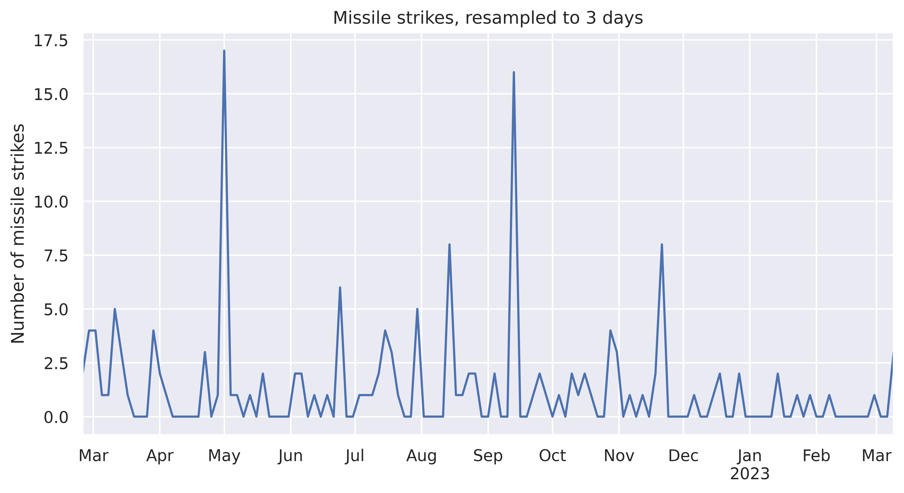
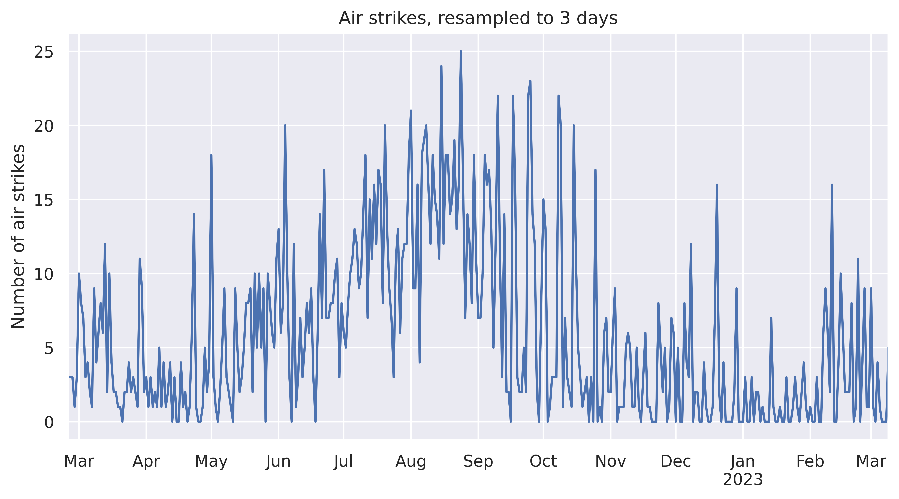
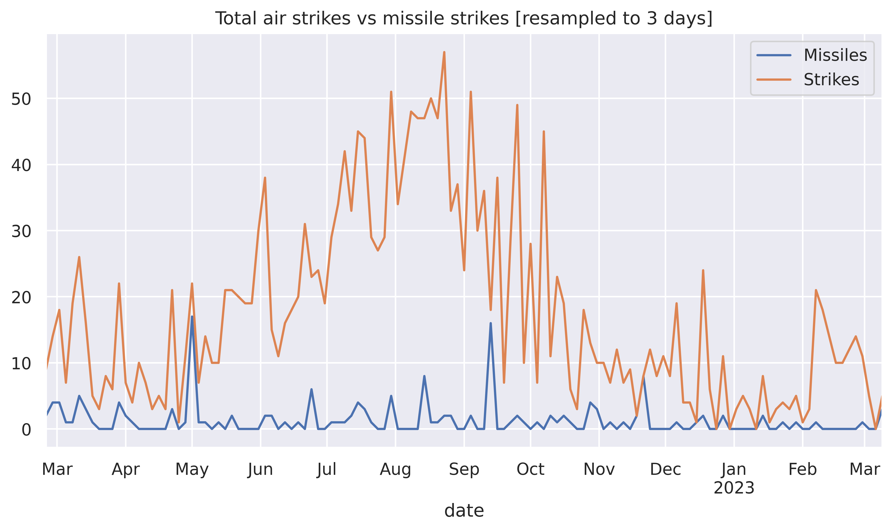
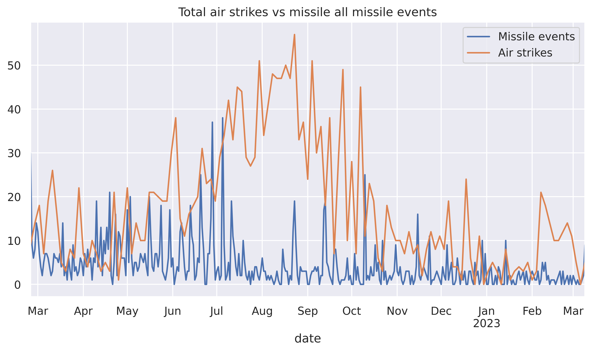
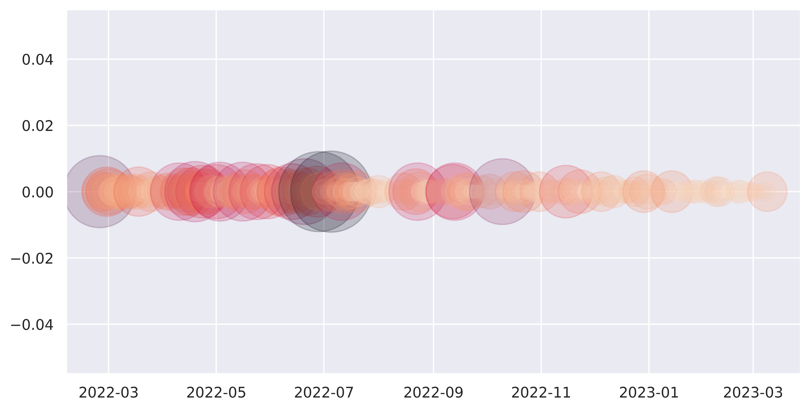
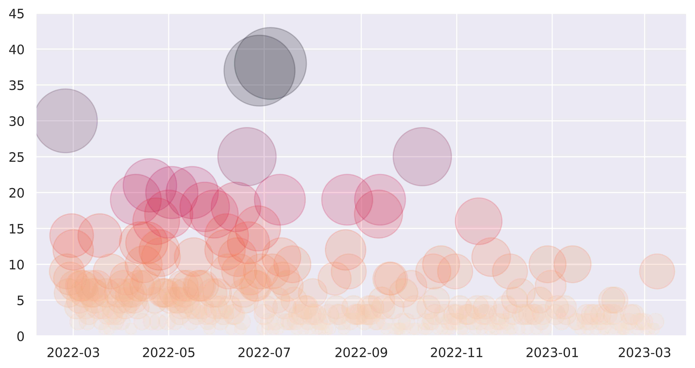
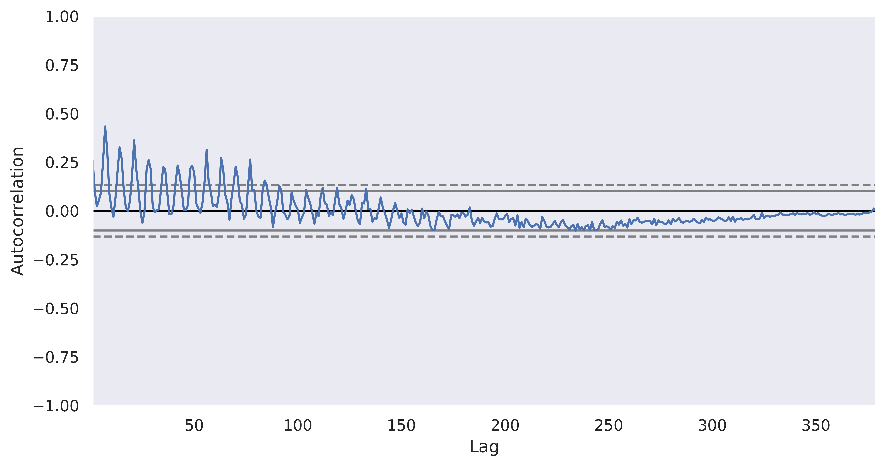
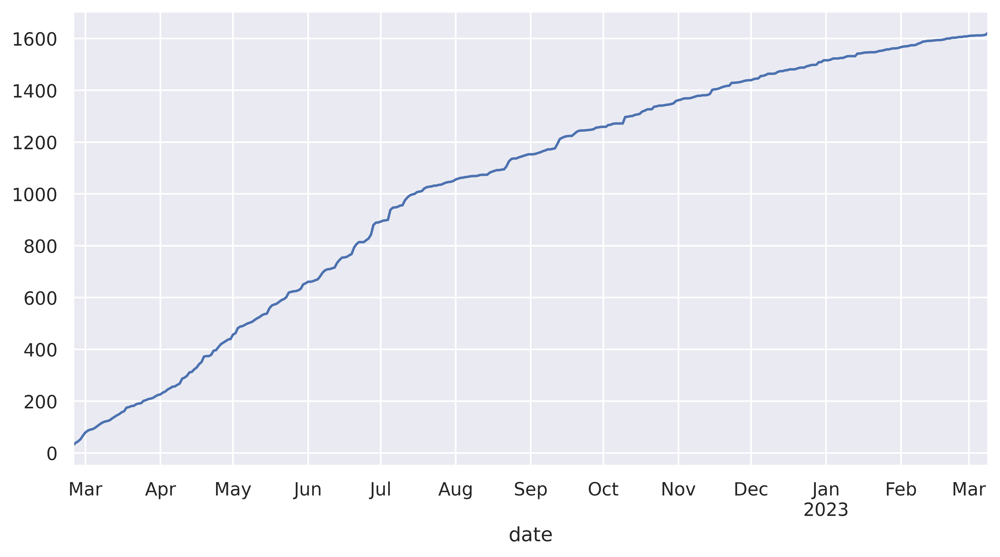
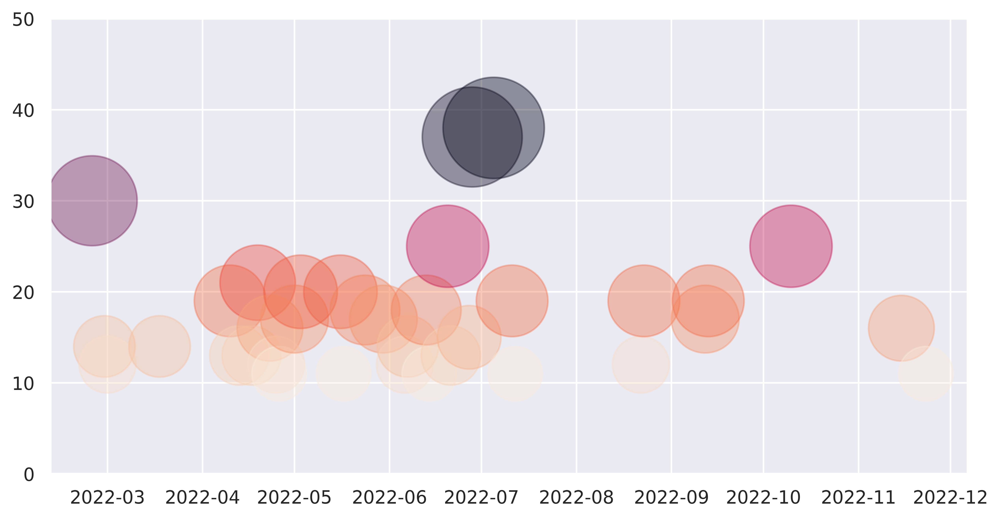
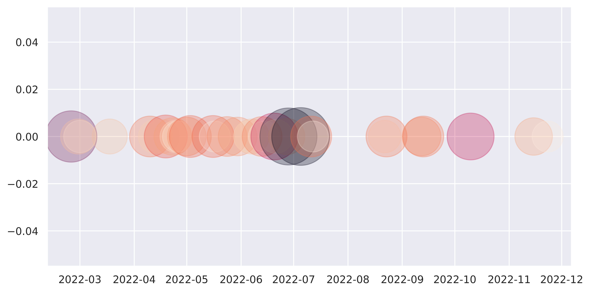

# Analysis of ACLED data

Data from ACLED's [Ukraine Crisis](https://acleddata.com/ukraine-crisis/)
datasets, which can be obtained through creating a free account.

### Preparation

Obtain `Ukraine_Black_Sea_2020_2023_Mar10.xlsx` from ACLED.

### Analysis

See the accompanying ipython jupyter notebook:
[acled_analysis.ipynb](acled_analysis.ipynb)

Total missile events (only those with category "Air")

Total "Air" strikes, including missile events

Missile (only those with category "Air") vs all "Air" events

Missile events vs all "Air strike" events

Scatter plot of "missile" events, 1-dimensional

Scatter plot of "missile" events, 2-dimensional

Scatter plot of "missile" events, 2-dimensional

Autocorrelation of missile events

Missile events, cumulative

Missile events, cumulative, regression fitted

Missile "barrages" (more than 10 per day), scatter plot 2-dimensional

Missile "barrages" (more than 10 per day), scatter plot 1-dimensional

